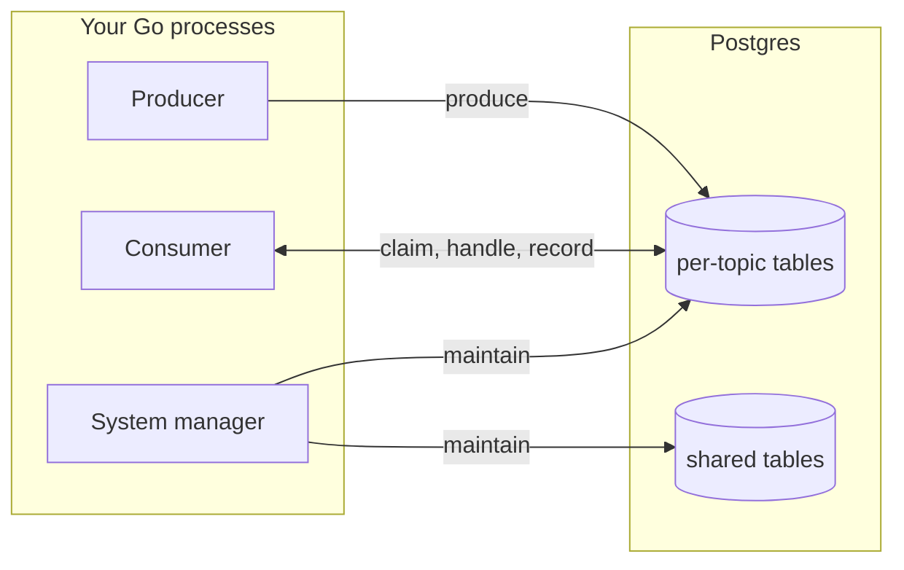

# Architecture

A map of the code. How Vulkan behaves at runtime is on the doc site
under Concepts / Architecture. The rules are in
[CONVENTIONS.md](CONVENTIONS.md).

## Overview

Vulkan is a Go library that uses Postgres as the message broker. There
is no server. A process can be a producer, a consumer, a system manager
that runs the maintenance workers, or all three. Each topic owns its own
set of tables, named with the topic id (`message_log_1`). Shared tables
list the topics, groups, workers, and schedules.

## Where to start reading

- Client: [pkg/vulkan/client.go](pkg/vulkan/client.go).
- Producer: [pkg/producer/producer_instance.go](pkg/producer/producer_instance.go).
- Consumer: [pkg/consumer/consumer_instance.go](pkg/consumer/consumer_instance.go).
- System manager: [pkg/systemmanager/systemmanager.go](pkg/systemmanager/systemmanager.go).
- Tables: [pkg/topic/controller/datastore/tables.go](pkg/topic/controller/datastore/tables.go).

## Code map

The root module is the library. Nested modules with their own `go.mod`:

| Module | Holds |
| --- | --- |
| `cmd/vulkan` | CLI |
| `otel` | metrics exporter |
| `.e2e` | end-to-end tests and their support commands |
| `.examples` | runnable user examples |
| `.bench` | benchmarks and the reliability lab |
| `.tools` | convention tests, compatibility checks, doc-site exports |

Under `pkg/`, a package is one of three kinds:

| Kind | Packages |
| --- | --- |
| shared by everything | `common` (Owner, Message, RetryPolicy, errors, logging), `datastore` (pool, transactions) |
| one per resource or activity | `topic`, `produce`, `consume`, `compaction`, `schedule`, `worker`, `metrics`, `alert`, `system`, `migrate` |
| the three boxes on the left, no SQL of their own | `vulkan`, `producer`, `consumer`, `scheduler`, `systemmanager`, `admin` |

The workers the system manager runs are under the package whose tables
they maintain: `topic/janitor`, `consume/janitor`,
`consume/cursoradvancer`, `schedule/producer`, `metrics/collector`, and
the checks under `alert`.

## Invariants

- No server or daemon. The library runs in your process.
- No dependency beyond the standard library, `pgx`, and `x/sync`.
- No LISTEN/NOTIFY. Everything polls.
- No `topic_id` column on a per-topic table. The table name says which
  topic.
- No transaction shared with the application except during produce.
- No payload or user document in a log line or error.

## Everywhere

- Errors, events, metrics, and alerts are declared with a `VKnnnn` code
  in each package's `errors.go`, `events.go`, `metrics.go`, and
  `alerts.go`. `vulkan explain` reads them.
- `DatastoreRetry` wraps every public datastore method. Transient errors
  are retried. Permanent ones are not.
- Configs hold optional fields only, filled by `WithDefaults()` then
  checked by `Validate()`.
- Per-topic tables are named only through the functions in `pkg/topic`.
